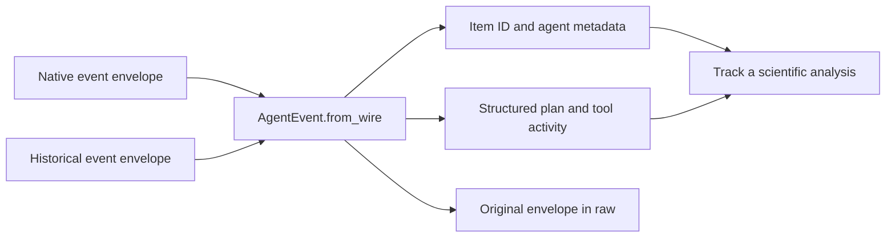

# Normalized agent events

`AgentEvent.from_wire()` exposes native tool progress, plans, context compaction,
child-agent activity, and context-token counts alongside historical events. Each
event retains the complete server envelope in `raw`, including unknown fields.



For example, a `tool_progress` event previously appeared as `type="other"`.
It now exposes `type="tool_progress"`, the command's `item_id`, output in `text`,
and child-agent identity in `metadata`. This lets a notebook distinguish two
agents inspecting different samples and associate their progress with the right
work. A completed tool or child agent does not mark the whole run complete.

| Wire event | Normalized type | Useful fields |
| --- | --- | --- |
| `tool_call` | `tool_use`, or `tool_update` for metadata changes | `item_id`, `tool_name`, `metadata` |
| `tool_output` | `tool_result` | `item_id`, JSON text in `text` for structured output |
| `tool_progress` | `tool_progress` | `item_id`, output delta in `text` |
| `plan_update`, `context_compaction`, `subagent_update` | Same name | `payload`, `metadata` |
| `context_tokens` | `context_tokens` | Token counts in `payload` |
| `runtime_state`, `run.accepted` | `init`, `accepted` | Original details in `raw` |
| `run.rejected`, `run_cancelled` | `rejected`, `cancelled` | Terminal event; rejection reason in `text` |

Partial assistant frames continue to normalize as `typing` by default. A consumer
that replaces text segments by ID can opt into `text_update`:

```python
from mantis_sdk import AgentEvent

event = AgentEvent.from_wire(
    {"sender": "ai", "id": "segment-1", "message": "Comparing samples", "partial": True},
    text_updates=True,
)
segments = {}
segments[event.item_id] = event.text  # Replace this segment; do not append snapshots.
```

`Provider.Cartographer` adds the `cartographer` provider value. Existing provider
values, session defaults, and session methods remain compatible. Normalizing an
event does not select or start a runtime.

`AgentResult` accepts optional `completed`, `cancelled`, `message_id`, and
`runtime_run_id` fields for delivery-aware consumers. Legacy sessions continue to
populate `failed` and `error`; they do not populate these new outcome fields.
