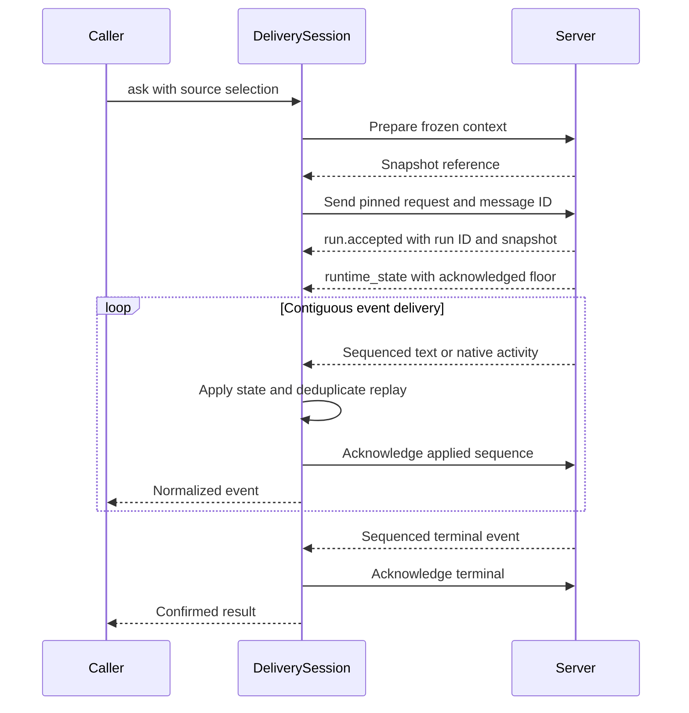

# Frozen-context delivery sessions

`client.agents.delivery_session(...)` creates an explicit Cartographer client for
the version 1 delivery protocol. It requires a model ID supported by the
deployment and uses the configured signed-in session cookie for its WebSocket.
The existing `session(...)` and `run_sync(...)` APIs keep their defaults and wire
format.

```python
session = client.agents.delivery_session(
    space_id,
    model_id=deployment_model_id,
    user_email=user_email,
    space_state_id=space_state_id,
    reasoning_effort="high",
)
async with session:
    async for event in session.ask(
        "Compare the selected samples and explain the evidence.",
        active_map_id=map_id,
        point_ids=selected_point_ids,
    ):
        print(event.type, event.item_id)

result = session.result()
if result.completed:
    print(result.text)
```

The client prepares a server snapshot before sending the turn. Alternatively,
pass the object returned by `prepare_context()` as `context_snapshot`; only its
version and ID are sent. A snapshot cannot be combined with live source choices.
The request pins the message UUID, runtime, model, reasoning effort, and snapshot.
The first turn must receive a matching `run.accepted` snapshot before any event
is applied or acknowledged. Early frames are buffered within the replay bound.
The supported effort values are `low`, `high`, and `max`.



For scientific workflows, stable text segments and native agent identities keep
replayed progress from duplicating the analysis output. The pinned snapshot
identifies the source selection for the turn, while separate terminal flags keep
a partial answer from being mistaken for a completed analysis.

## Reconnect and resume

After an interrupted stream, retain the same session object, reconnect, and call
`resume()`. It resends the exact saved request instead of preparing new sources or
starting another message. Changes to the original snapshot dictionary do not
change the saved request.

```python
await session.close()
async with session:
    async for event in session.resume():
        print(event.type, event.item_id)
result = session.result()
```

Event application precedes acknowledgment. If an acknowledgment is lost, the
client retains the applied state and acknowledges replay without duplicating
its result. Repairing a terminal acknowledgment waits for the current
connection's matching cursor handshake. A notification might not reach the caller if transport failure
occurs between state application and yielding the event; inspect `result()` after
an interruption. This protocol does not promise exactly-once execution of caller
callbacks.

The current result, request, and acknowledgment cursor are held in memory. This
API does not restore them after process restart. A server acknowledgment floor
beyond the retained local state is rejected instead of silently skipping output.
Out-of-order buffering and recent replay-identity tracking are bounded to 2,048
entries. Conflicting sequences or reused delivery identities raise a protocol
error.

## Completion and cancellation

| Observation | Result |
| --- | --- |
| Contiguously applied `chat_complete` | `completed=True` |
| Admission rejection before a run exists, or an applied failure terminal | `failed=True`, with `error` |
| Authoritative cancellation terminal | `cancelled=True` |
| Partial text, completed tool, or completed child agent | No whole-run completion |
| Timeout, disconnect, closed socket, or stopped iterator | Does not itself confirm a terminal or cancel the server turn |
| Rejected resume after a run was admitted | Raises an error; does not claim that the original run failed |

`await session.cancel()` requests cancellation of the exact message/run. Continue
consuming `ask()` or `resume()` until a terminal arrives. A cancellation rejection
keeps the turn active. Only the server's canonical cancellation terminal can
authorize discarding a missing progress prefix; ordinary completion cannot skip
missing output.

One consumer can stream a session at a time. Closing an iterator releases that
consumer and preserves the unfinished request for `resume()`. Start a new message
only after the previous turn has a confirmed terminal or was rejected before
admission. Reusing an earlier message UUID for a new turn is rejected.
